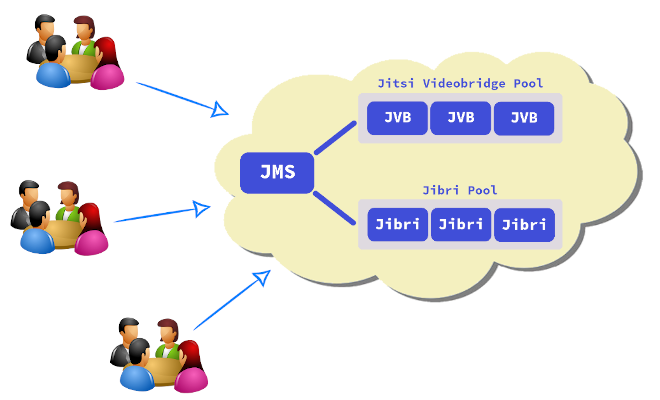

Easy way to create Jitsi cluster based on Debian Buster
=======================================================
This tutorial provides step by step instructions on how to create Jitsi cluster
based on Debian Buster (Debian 10). Create or install a Debian Buster machine
for each node in this tutorial. Please, don't install a desktop environment,
only the standard packages...

## Jitsi Meet Server (JMS)
JMS is a standalone server with conferance room, video recording and streaming
features. If the load level is low and simultaneous recording will not be made,
JMS can operate without an additional JVB or Jibri nodes.

Additional JVB and Jibri nodes can be added in the future if needed.

### Before Installing JMS
- A resolvable host address is required for the JMS server and this address
  should point to this server. Therefore, create the DNS A record before
  starting the installation.

- JMS also needs the `snd_aloop` kernel module but some cloud computers have a
  kernel that doesn't support it. In this case, first install the standart
  kernel and start the machine with this kernel.

Run the following command to check the `snd_aloop` support. If the command has
an output, it means that the kernel doesn't support it.

```bash
modprobe snd_aloop
```
