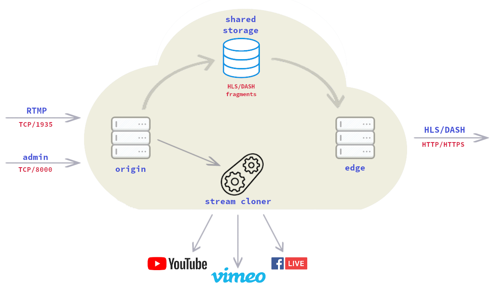

Easy way to install a live streaming media system
=================================================
- [1. About](#1-about)
- [2. Prerequisites](#1-prerequisites)
- [3. Installing](#3-installing)
  - [3.1 Downloading the installer](#31-downloading-the-installer)
  - [3.2 Running the installer](#32-running-the-installer)
  - [3.3 Let's Encrypt certificate](#33-lets-encrypt-certificate)

---

## 1. About
This tutorial provides step by step instructions on how to install a live
streaming media system based on Debian Buster (Debian 10).

Create or install a Debian Buster server first and then follow the
instructions. Please, don't install a desktop environment, only the standard
packages... At least 2 cores and 4 GB RAM is recommended for this setup.

Run each command on this tutorial as `root`.

## 2. Prerequisites
If the server is behind a firewall, open the following ports:

* TCP/80
* TCP/443
* TCP/8000
* TCP/1935

## 3. Installing
Installation will be done with
[emrah-buster](https://github.com/emrahcom/emrah-buster-templates) installer.

#### 3.1 Downloading the installer
```bash
wget https://raw.githubusercontent.com/emrahcom/emrah-buster-base/master/installer/eb
wget https://raw.githubusercontent.com/emrahcom/emrah-buster-templates/master/installer/eb-livestream.conf
```

#### 3.2 Running the installer

```bash
bash eb eb-livestream
```

#### 3.3 Let's Encrypt certificate
This is optional. You don't have to use a certificate.

Let's say the host address is `live.mydomain.com`
To set the Let's Encrypt certificate:

```bash
set-letsencrypt-cert live.mydomain.com
```
